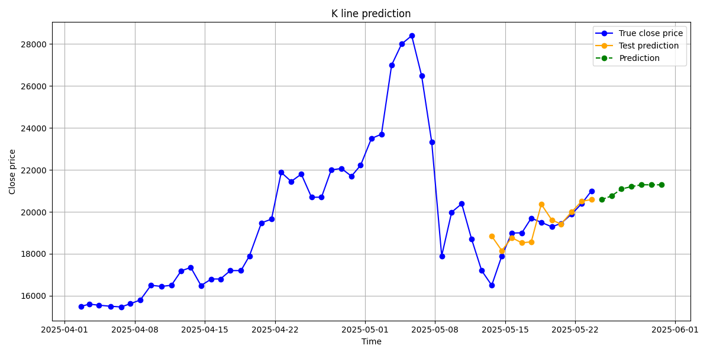

# CSTrader

## Introduction

CSTrader is a trading data collector and predictor. It includes K-line visualization and prediction examples as shown below:

  


## How to Use

### 1. Prepare the Configuration File

To begin, configure your data source. Navigate to the appropriate collector directory under `scripts/data_collector/` and create a `.json` file for your target source.

For example, to collect data from BUFF:

1. Go to `scripts/data_collector/buff`.
2. Create a file named `buff_config.json`.
3. Use `example_config.json` as a template to complete your configuration.

> ⚠️ The most critical field in the config is the **cookie**.

#### How to Obtain the Cookie

1. Open the referer webpage in your browser and press `F12` to open the developer tools.
2. Navigate to the **Network** tab and filter for `XHR/Fetch` requests.
3. Refresh the page if necessary, and select a target file (e.g., `bill_order`).
4. Go to the **Headers** section and find the **Request Cookie** field.
5. Copy the entire cookie value and paste it into your `.json` config.

Example:


### 2. Install Dependencies and Run

```bash
pip install -r requirements.txt
python main.py
```

## License

This project is licensed under the MIT License - see the [LICENSE](./LICENSE) file for details.
